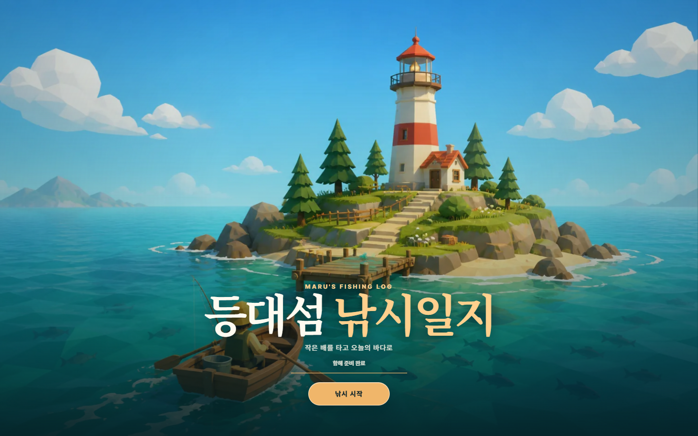
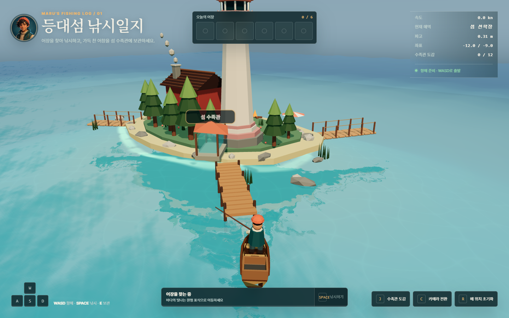
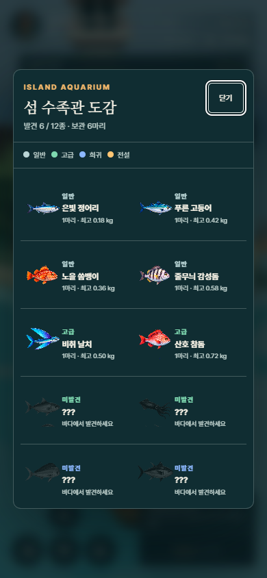

# 등대섬 낚시일지

작은 나룻배를 몰고 등대섬 주변의 어장을 탐색해 물고기를 낚고, 잡은 물고기를 섬 수족관 도감에 보관하는 브라우저 기반 3D 낚시 게임입니다.



## 게임 소개

`등대섬 낚시일지`는 Three.js와 Vite로 제작한 로우폴리 스타일의 짧은 항해·낚시 경험입니다. 플레이어는 파도에 반응하는 나룻배를 직접 조종해 빛나는 어장을 찾고, 캐스팅과 장력 조절을 거쳐 물고기를 낚습니다. 잡은 물고기는 최대 6마리까지 배에 실을 수 있으며, 선착장으로 돌아오면 수족관 도감에 영구 보관됩니다.



## 주요 특징

- 로우폴리 등대섬과 나룻배로 구성된 실시간 3D 바다
- 파도 높이에 맞춰 움직이는 부력, 피치·롤, 항적 표현
- 어장 탐색 → 캐스팅 → 입질 대기 → 장력 조절 → 포획으로 이어지는 낚시 흐름
- 일반·고급·희귀·전설 등급을 포함한 12종의 물고기 도감
- 어창 용량과 선착장 보관을 결합한 짧은 수집 루프
- 데스크톱 키보드와 모바일 터치 조작 지원
- 후면 추적·전체 조망 카메라 전환 및 반응형 HUD

## 플레이 방법

1. `낚시 시작`을 누른 뒤 나룻배를 몰아 바다의 빛나는 원형 어장으로 이동합니다.
2. 어장 안에서 낚시를 시작하고 입질을 기다립니다.
3. 물고기가 물면 낚싯줄의 장력이 너무 팽팽하거나 느슨해지지 않도록 조절합니다.
4. 잡은 물고기로 어창을 채운 뒤 섬 선착장으로 돌아갑니다.
5. 물고기를 수족관에 보관해 12종의 도감을 완성합니다.

## 조작법

| 입력 | 동작 |
| --- | --- |
| `W` / `A` / `S` / `D` | 전진·좌회전·후진·우회전 |
| `Space` 또는 `F` | 낚시 시작, 캐스팅, 장력 조절 |
| `E` | 선착장에서 어창 보관 |
| `J` | 수족관 도감 열기 |
| `C` | 카메라 시점 전환 |
| `R` | 배 위치 초기화 |

모바일에서는 화면의 방향 버튼과 상황별 액션 버튼으로 같은 기능을 사용할 수 있습니다.

## 수족관 도감

잡은 물고기의 발견 여부, 보관 수량, 최고 무게를 등급별로 확인할 수 있습니다.

<p align="center">
  
</p>

## 기술 구성

- [Three.js](https://threejs.org/) — 3D 렌더링, 셰이더, 모델 로딩, 파티클과 조명
- [Vite](https://vite.dev/) — 개발 서버와 프로덕션 빌드
- JavaScript, HTML, CSS
- GLB 기반 등대섬·나룻배 모델과 절차적 폴백 메시

## 로컬에서 실행하기

Node.js 20 이상을 권장합니다.

```bash
npm install
npm run dev
```

터미널에 표시되는 로컬 주소를 브라우저에서 열면 게임을 실행할 수 있습니다.

프로덕션 빌드는 다음 명령으로 확인합니다.

```bash
npm run build
npm run preview
```

## 프로젝트 구조

```text
threejs-lighthouse/
├─ public/
│  ├─ assets/          # 타이틀, 캐릭터, 물고기 도감 이미지
│  └─ models/          # 등대섬과 나룻배 GLB 모델
├─ src/
│  ├─ main.js          # 장면, 바다, 항해, 카메라와 렌더 루프
│  ├─ fishingGame.js   # 어장, 낚시, 어창과 수족관 시스템
│  ├─ createProceduralBoat.js
│  └─ styles.css       # HUD와 반응형 인터페이스
├─ docs/screenshots/   # README 미리보기 이미지
└─ index.html
```

## 현재 범위

이 저장소는 완성된 웹 낚시 게임의 실행 소스와 런타임 에셋을 담고 있습니다. Blender 원본, 콘셉트 제작 과정, 검증용 중간 산출물은 저장소 크기를 줄이기 위해 제외했습니다.
